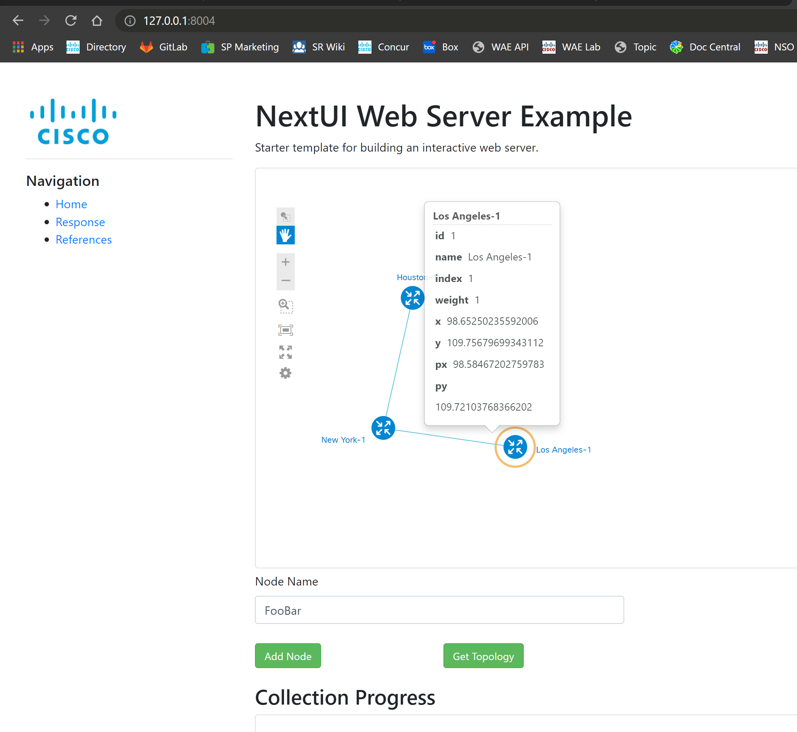

# Overview
Sample web server and client application.  Can be used for prototyping and demonstrations.  Uses tornado web server framework and javascript client.

# Setup Instructions

1) Create a Python 3.7 virtual environment (or latest Python 3 distribution).

2) Activate the virtual environment.

3) Install required packages.

`pip install -r requirements.txt`

# Startup

To start the server:

`python server.py --port [_port number_]`

Example,

    (python3.7-venv) python server.py --port 8000`
    
Open a Web browser and enter the URL, example

`http://127.0.0.1:8000/`

Test the REST call using the sample URL provided.

**Note: the web client is not calling the REST URL directly.  Rather it is sending the URL to the server and the server executes the REST call and sends the results back to the client.**

# Useful Links
DevNet NextUI Links
https://developer.cisco.com/site/neXt/discover/demo/#Basic/base

DevNet Support
https://devnetsupport.cisco.com/hc/en-us/articles/115011228968-Topology-with-icons

Cisco Community
https://community.cisco.com/t5/custom/page/page-id/customFilteredByMultiLabel?board=j-disc-dev-net-tools&labels=next

Next Tutorials
https://github.com/NeXt-UI/next-tutorials

Codepen Examples
https://codepen.io/NEXTSUPPORT/pens/popular

JSFiddle Examples
http://jsfiddle.net/user/nextsupport/fiddles/